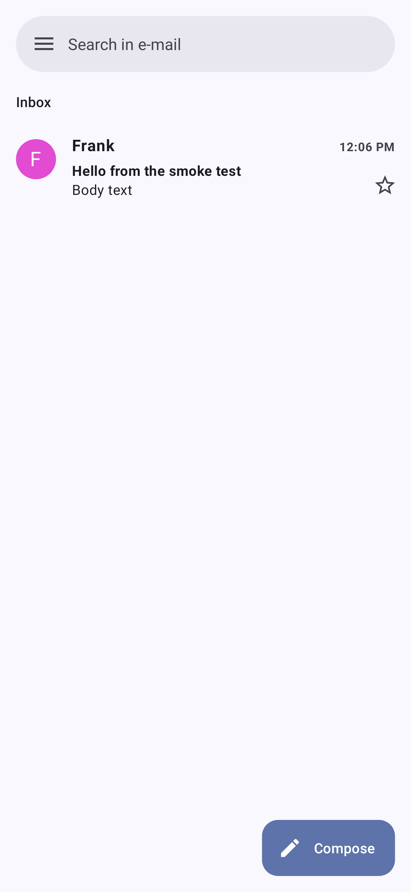
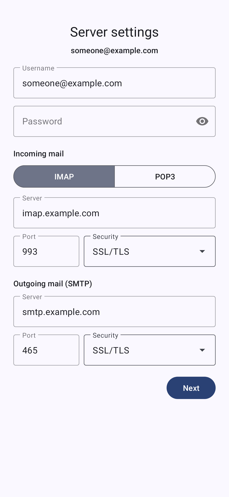

# Ripple

A Material 3 email app for Android. Ripple keeps the Gmail-style interface of
[Ltt.rs](https://codeberg.org/iNPUTmice/lttrs-android) and replaces its JMAP
layer with the IMAP, POP3 and SMTP engine of
[Thunderbird for Android](https://github.com/thunderbird/thunderbird-android)
(formerly K-9 Mail). Mail arrives instantly through IMAP IDLE.

<p align="center">


</p>

(Rendered by `UiSmokeTest` from mail synced off a local IMAP server.)

## Features

- **Any IMAP or POP3 account** with SMTP for sending. The address is enough in
  most cases: settings come from a built-in list (Gmail, Outlook.com, Yahoo,
  iCloud, AOL), Thunderbird's ISP database, the provider's own autoconfig
  file, or the MX record. Manual server settings are always available.
- **Sign in with Google or Microsoft** (OAuth 2.0, XOAUTH2) when the build has
  OAuth client ids (see below). Without them, Gmail and Outlook work with an
  app password.
- **Instant delivery.** A foreground service keeps one IMAP IDLE connection
  per account and syncs the inbox the moment the server reports new mail, then
  posts a notification. A 15-minute background refresh covers POP3 accounts,
  servers without IDLE, and times the service is not running.
- **Gmail-like conversations.** Messages are grouped into threads by
  Message-ID, In-Reply-To and References across all folders, so your replies
  from the Sent folder appear in the conversation.
- Everything Ltt.rs offers: archive, trash, labels (IMAP folders; real labels
  on Gmail), stars, read state, search, compose with attachments, drafts,
  multiple accounts, dynamic colour, dark theme.

Not included (yet): end-to-end encryption (Ltt.rs' Autocrypt was built on
JMAP), HTML rendering (HTML-only mail is shown as text), server-side search.

## Layout

| Path | What |
|---|---|
| `app/` | The Ltt.rs app (Java, XML views, Room). Package names stay `rs.ltt.android`; the application id is `app.ripple.mail`. |
| `app/src/main/java/rs/ltt/android/engine/` | Ripple's glue (Kotlin): `Mua` (the operations the UI asks for), `RoomBackendStorage` (lets Thunderbird's sync write into Room), `MessageMapper`, `QueryEngine` (answers the UI's queries locally), `MimeComposer`, `Autoconfig`, `OAuth`. |
| `app/src/main/java/rs/ltt/android/push/` | `PushService` (IMAP IDLE foreground service), `PushController`, `BootReceiver`. |
| `app/src/main/java/rs/ltt/android/mail/` | Plain data classes and helpers the UI uses, taken from Ltt.rs' `jmap-common`/`jmap-mua-util` libraries (Lombok expanded). |
| `engine/` | Thunderbird for Android's `mail/*` and `backend/*` modules, vendored. See `engine/README.md`. |

## Building

Needs JDK 21 and the Android SDK (platform 36).

```sh
./gradlew :app:assembleDebug        # app/build/outputs/apk/debug/
./gradlew :app:testDebugUnitTest    # includes tests against a real IMAP/SMTP server (GreenMail)
```

CI (`.github/workflows/build-ripple.yml`) runs the tests and uploads a release
APK as the `Ripple-apk` artifact. It signs with the `RIPPLE_KEYSTORE_*`
secrets, else Tidewall's key, else a throwaway debug key.

### OAuth client ids (optional)

Put them in `local.properties` or the environment (CI: repository secrets):

```
RIPPLE_GOOGLE_CLIENT_ID=1234-abc.apps.googleusercontent.com
RIPPLE_MICROSOFT_CLIENT_ID=00000000-0000-0000-0000-000000000000
```

- **Google:** Google Cloud console → APIs & Services → Credentials → OAuth
  client ID of type *Android*, package `app.ripple.mail`, SHA-1 of the key
  that signs your APK; under *Advanced settings* enable *Custom URI scheme*
  (Ripple uses the `com.googleusercontent.apps.<id>:/oauth2redirect`
  redirect). Add the scope `https://mail.google.com/`. While the
  consent screen is in *Testing* only listed test users can sign in and
  refresh tokens expire after 7 days; publishing needs Google's verification
  of this restricted scope.
- **Microsoft:** Entra admin center → App registrations → New registration,
  "Accounts in any organizational directory and personal Microsoft accounts".
  Add a *Mobile and desktop applications* redirect URI
  `app.ripple.mail://oauth2redirect`, and API permissions (Office 365 Exchange
  Online / delegated) `IMAP.AccessAsUser.All`, `SMTP.Send`, plus
  `offline_access`, `openid`, `email`, `profile`.

## Licences

Apache License 2.0 (see `LICENSE`). Ripple is based on Ltt.rs by Daniel
Gultsch and on Thunderbird for Android / K-9 Mail by the Thunderbird and K-9
Mail contributors, both Apache-2.0. Ripple is not affiliated with either
project.
